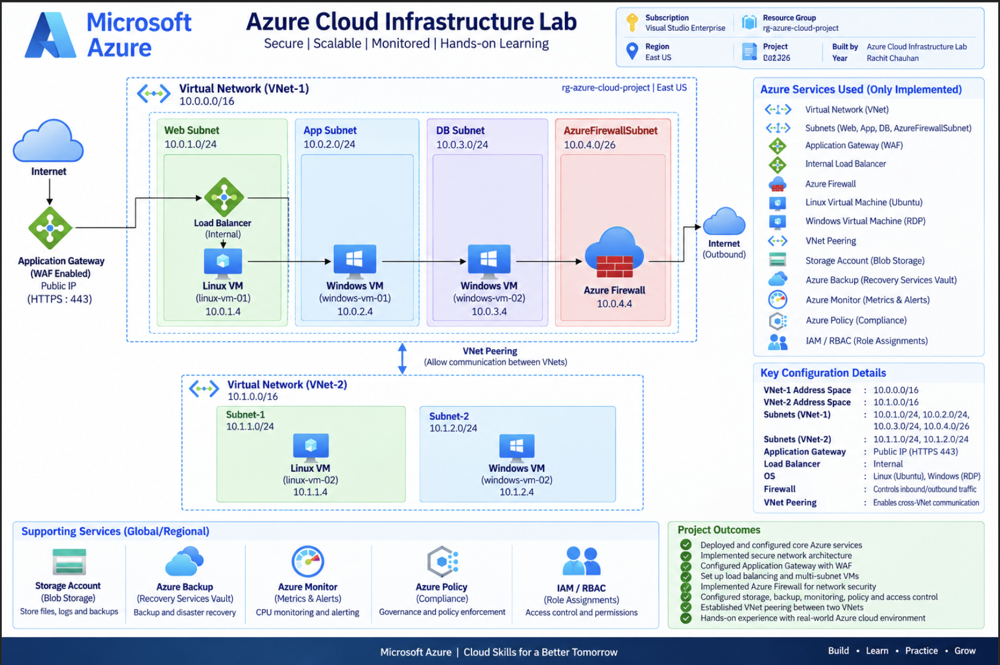

# Azure Cloud Infrastructure Lab 

A hands-on Azure cloud infrastructure project built to demonstrate
core cloud networking, compute, security, backup, storage, identity,
load balancing, firewall, application delivery, and monitoring concepts.

The infrastructure was designed and implemented using Microsoft Azure
with practical configuration, connectivity testing, and monitoring
evidence.

---

## Architecture



The architecture uses a custom Azure Virtual Network with dedicated
subnets for web, application, database segmentation, and Azure Firewall.

Linux and Windows Virtual Machines were deployed into the VNet and
secured using Network Security Groups.

A second Virtual Network was created and connected using VNet Peering
to demonstrate VNet-to-VNet connectivity.

Azure Load Balancer, Azure Firewall, and Azure Application Gateway were
configured to demonstrate different layers of traffic management and
security.

Azure Backup, Azure Storage Account, Azure Policy, RBAC, and Azure
Monitor were also implemented as part of the infrastructure lab.

---

## Azure Services Used

- Azure Resource Group
- Azure Virtual Network (VNet)
- Subnets
- Network Security Groups (NSG)
- Linux Virtual Machine
- Windows Virtual Machine
- Azure Recovery Services Vault
- Azure Backup
- VNet Peering
- Azure Storage Account
- Azure Blob Storage
- Azure Policy
- Azure IAM
- Azure RBAC
- Azure Load Balancer
- Azure Firewall
- Azure Application Gateway
- Azure Monitor
- Metric Alerts

---

## Network Architecture

### Resource Group

- Resource Group: `rg-azure-cloud-project`
- Region: `East US`

### Main VNet

- VNet Name: `vnet-azure-project`
- Address Space: `10.0.0.0/16`
- Region: `East US`

### Main Subnets

| Subnet | CIDR | Purpose |
|---|---|---|
| web-subnet | `10.0.1.0/24` | Linux VM / Web workload |
| app-subnet | `10.0.2.0/24` | Windows VM / Application workload |
| db-subnet | `10.0.3.0/24` | Database network segmentation |
| AzureFirewallSubnet | `10.0.4.0/26` | Azure Firewall |

### Peering VNet

- VNet Name: `vnet-peering-01`
- Address Space: `10.1.0.0/16`
- Subnet: `peering-subnet`
- Subnet CIDR: `10.1.0.0/24`

The main VNet and peering VNet were connected using Azure VNet
Peering.

Connectivity between workloads in both VNets was tested successfully.

---

## Network Security

Network Security Groups were configured to control network traffic
between different workloads.

### Web NSG

- HTTP (80)
- HTTPS (443)
- SSH (22) restricted to the allowed client IP

### App NSG

- TCP 8080 from the web subnet
- RDP (3389) for Windows VM access

### DB NSG

- PostgreSQL (5432) from the application subnet

Subnet-to-NSG associations were also configured and verified.

---

## Compute

### Linux Virtual Machine

- VM Name: `linux-vm-01`
- OS: Ubuntu Server 24.04 LTS
- Size: `Standard B2ms`
- Subnet: `web-subnet`
- Private IP: `10.0.1.4`
- SSH access

Nginx was installed on the Linux VM and tested successfully.

The following operations were verified:

- SSH connectivity
- Internet connectivity
- Nginx service status
- Local HTTP response
- HTTP `200 OK` response

### Windows Virtual Machine

- VM Name: `windows-vm-01`
- OS: Windows Server 2025 Datacenter: Azure Edition
- Size: `Standard B2ms`
- Subnet: `app-subnet`
- Private IP: `10.0.2.4`
- RDP access

Basic network connectivity was tested using PowerShell.

---

## Azure Backup

Azure Recovery Services Vault was configured for VM protection.

### Recovery Services Vault

- Vault Name: `rsv-azure-project`
- Region: East US
- Replication: LRS

The following virtual machines were protected:

- `linux-vm-01`
- `windows-vm-01`

An Azure Backup Policy was configured with scheduled backup and
retention settings.

---

## VNet Peering

A second VNet was created to demonstrate VNet-to-VNet connectivity.

### Main VNet

`vnet-azure-project`

`10.0.0.0/16`

### Peering VNet

`vnet-peering-01`

`10.1.0.0/16`

A second Windows VM was deployed in the peering VNet:

- VM Name: `windows-vm-02`
- Private IP: `10.1.0.4`

### Connectivity Testing

Linux VM → Windows VM:

```bash
nc -zv 10.1.0.4 3389

```

---

## Storage Account

An Azure Storage Account was created to demonstrate Azure Blob
Storage and basic storage operations.

### Configuration

- Storage Account: `azureproject1234`
- Performance: Standard
- Replication: LRS
- Account Kind: StorageV2
- Access Tier: Hot
- Blob Container: `project-files`

### Operations Tested

- Storage Account creation
- Blob container creation
- File upload
- File download
- File deletion
- Basic storage access concepts

---

## Azure Policy

Azure Policy was configured to demonstrate Azure governance and
resource compliance.

### Policy Configuration

- Policy: `Allowed locations`
- Scope: Visual Studio Enterprise Subscription
- Allowed Location: East US

The policy compliance dashboard was used to verify the policy
assignment and identify compliant and non-compliant resources.

---

## IAM / Roles / Policies

Azure IAM concepts were explored using Access Control (IAM).

The project demonstrates:

- Azure identity and access concepts
- Built-in Azure roles
- Role permissions
- Resource-level access control

---

## RBAC

Role-Based Access Control was configured to demonstrate practical
resource access management.

### Role Assignment

- Role: `Reader`
- Member: `Rachit`
- Scope: `rg-azure-cloud-project`
- Assignment type: User

The Reader role assignment was verified from the Resource Group
Access Control (IAM) page.

---

## Azure Load Balancer

An Azure Load Balancer was configured to demonstrate Layer 4
network traffic distribution.

### Configuration

- Load Balancer: `lb-azure-project`
- SKU: Standard
- Type: Public
- Region: East US
- Frontend IP Configuration: `lb-frontend-ip`
- Backend Pool: `lb-backend-pool`
- Health Probe: `lb-health-probe-ssh`
- Load Balancing Rule: `lb-rule-ssh`

### Backend

- VM: `linux-vm-01`
- Private IP: `10.0.1.4`
- Backend Port: `22`
- Protocol: TCP

The backend health was verified successfully.

SSH connectivity through the Azure Load Balancer public IP was
also tested successfully.

---

## Azure Firewall

Azure Firewall was configured to demonstrate network traffic
filtering and firewall traffic flow.

### Configuration

- Firewall Policy: `azfw-policy`
- Firewall Subnet: `AzureFirewallSubnet`
- Subnet CIDR: `10.0.4.0/26`
- Public IP: `azfw-public-ip`

Network rules were configured and firewall traffic flow was
tested successfully.

---

## Azure Application Gateway

Azure Application Gateway was configured to demonstrate Layer 7
application traffic routing.

### Configuration

- Application Gateway: `appgw-azure-project`
- Frontend configuration
- Backend pool
- HTTP listener
- Routing rule
- Health probe
- Dedicated Application Gateway subnet

The Linux VM running Nginx was configured as the backend workload.

### Backend Health

The Application Gateway backend health was verified successfully.

- Backend: `10.0.1.4`
- Backend Port: `80`
- Protocol: HTTP
- Status: Healthy
- Response: HTTP `200 OK`

This confirmed successful communication between the Application
Gateway and the Nginx web server.

---

## Azure Monitor

Azure Monitor was used to monitor VM performance through metrics
and configure a metric-based alert.

### VM Metrics

The Linux VM was monitored using:

- Metric: `Percentage CPU`
- Aggregation: Average
- Time Range: Last 24 hours

CPU utilization was visualized using Azure Monitor Metrics.

### CPU Alert

A metric alert was created for the Linux VM.

- Alert Name: `linux-vm-high-cpu-alert`
- Signal: `Percentage CPU`
- Condition: Greater than `80%`
- Aggregation: Average
- Check Every: 5 minutes
- Lookback Period: 5 minutes
- Severity: `3 - Informational`

The alert rule was successfully created and verified.

---

## Project Screenshots
---

### 1. Resource Group

[View Resource Group Screenshots](Screenshots/resource-group/)

### 2. Virtual Network (VNet)

[View VNet Screenshots](Screenshots/vnet/)

### 3. Subnets

[View Subnet Screenshots](Screenshots/subnets/)

### 4. Network Security Groups (NSGs)

[View NSG Screenshots](Screenshots/nsq-rules/)

### 5. Linux Virtual Machine

[View Linux VM Screenshots](Screenshots/linux-vm/)

### 6. Windows Virtual Machine / RDP

[View Windows VM Screenshots](Screenshots/windows-vm-rdp/)

### 7. Azure Backup

[View Azure Backup Screenshots](Screenshots/azure-backup/)

### 8. VNet Peering

[View VNet Peering Screenshots](Screenshots/vnet-peering/)

### 9. Storage Account

[View Storage Account Screenshots](Screenshots/storage-account/)

### 10. Azure Policy

[View Azure Policy Screenshots](Screenshots/azure-policy-compliance/)

### 11. IAM / RBAC

[View IAM / RBAC Screenshots](Screenshots/RBAC/)

### 12. Azure Load Balancer

[View Load Balancer Screenshots](Screenshots/load-balancer/)

### 13. Azure Firewall

[View Azure Firewall Screenshots](Screenshots/azure-firewall/)

### 14. Azure Application Gateway

[View Application Gateway Screenshots](Screenshots/application-gateway/)

### 15. Azure Monitor

[View Azure Monitor Screenshots](Screenshots/azure-monitor/)

---
---

## Testing and Verification

The following components were tested during the implementation:

- Azure Storage Account and Blob operations
- Azure Policy assignment and compliance
- IAM access configuration
- RBAC Reader role assignment
- Azure Load Balancer backend health
- Load Balancer connectivity
- Azure Firewall network rules
- Firewall traffic flow
- Application Gateway backend health
- Application Gateway HTTP connectivity
- Azure Monitor VM CPU metrics
- Azure Monitor CPU alert

---

## Key Concepts Demonstrated

- Azure Resource Group
- Azure Virtual Network (VNet)
- Subnets
- Network Security Groups (NSGs)
- Linux Virtual Machine
- Windows Virtual Machine
- Azure Backup
- Backup Policies
- VNet Peering
- Azure Storage Account
- Blob Storage
- Azure Policy
- IAM
- Azure RBAC
- Azure Load Balancer
- Azure Firewall
- Application Gateway
- Azure Monitor
- VM Metrics
- Metric Alerts

---

---

## Skills Demonstrated

**Cloud:** Microsoft Azure

**Networking:** VNet, Subnets, NSGs, VNet Peering

**Compute:** Azure Virtual Machines

**Storage:** Azure Storage Account, Blob Storage

**Backup:** Azure Backup, Recovery Services Vault, Backup Policies

**Security:** NSGs, Azure Firewall, IAM, RBAC

**Load Balancing:** Azure Load Balancer

**Application Delivery:** Azure Application Gateway

**Monitoring:** Azure Monitor, Metrics, Alerts

**Operating Systems:** Ubuntu Linux, Windows Server

**Administration:** SSH, RDP, Linux CLI, PowerShell

---

## Project Status

**Completed ✅**

This project was implemented hands-on in Microsoft Azure and
demonstrates practical experience with cloud infrastructure,
networking, compute, storage, backup, identity and access
management, load balancing, firewall configuration, application
delivery, and infrastructure monitoring.

---
